

  <h1> Burger Queen Api Client </h1>

  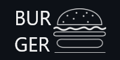

## Contents

* [1. Descripción del Producto](#1-Descripción-del-Producto)
* [2. Herramientas](#2-Herramientas)
* [3. User stories](#3-user-stories)
* [4. High fidelity prototypes](#4-high-fidelity-prototypes)
* [5. Deployed project](#5-deployed-project)
* [6. Authors](#6-authors)

## 1. Descripción del Producto

Este proyecto es una *single page application* hecha con *React* para un restaurante de hamburguesas llamado Burger Queen. Nuestra aplicación permite la gestión de las operaciones del restaurante en función de los roles de cada empleado, ayudándole a realizar sus tareas asignadas. 

Roles:
 
* **Administrador:** Persona a cargo de mantener y llevar el registo de los empleados, puede crear usuarios, editarlos y eliminarlos. 
* **Mesero:** Puede tomar y crear ordenes, editarlas y enviarlas al modulo de chef para iniciar su preparación, además el mesero tiene acceso a el set de ordenes ya listas para entregar a la mesa y al historial de ordenes entregadas. 
* **Chef:** Las personas de la cocina pueden ver la lista de ordenes enviadas por el mesero que necesitan ser preparadas, puede marcarlas como listas y puede ver el tiempo que tomo prepararlas.

Nuestra aplicación fue diseñada para ser usada en tablet. 

## 2. Herramientas

## 3. Historias de Usuario

HU 1: Mesero(a) debe poder ingresar al sistema, si el administrador ya le ha asignado credenciales. "Yo como mesero(a) quiero poder ingresar al sistema de pedidos."
HU 2: Mesero(a) debe poder tomar pedido de cliente. "Yo como mesero(a) quiero tomar el pedido de un cliente para no depender de mi mala memoria, para saber cuánto cobrar, y enviarlo a la cocina para evitar errores y que se puedan ir preparando en orden."
HU 3: Jefe de cocina debe ver los pedidos. "Yo como jefe(a) de cocina quiero ver los pedidos de los clientes en orden y marcar cuáles están listos para saber qué se debe cocinar y avisar a los meseros que un pedido está listo para servirlo a un cliente."
HU 4: Mesero(a) debe ver pedidos listos para servir. "Yo como mesero(a) quiero ver los pedidos que están preparados para entregarlos rápidamente a los clientes que las hicieron."
HU 5: Administrador(a) de tienda debe administrar a sus trabajadores. "Yo como administrador(a) de tienda quiero gestionar a los usuarios de la plataforma para mantener actualizado la información de mis trabajadores."

## 4. Prototipos 

Teniendo las historias de usuario en mente, creamos los prototipos de alta fidelidad con el deseo de entender las necesidades del usuario y proveer un flujo de trabajo optimo. Estos prototipos fueron claves para el desarrollo del proyecto.

### 4.1 Homepage y Login 

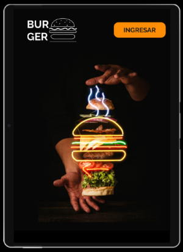 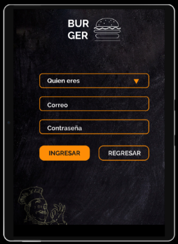

### 4.2 Mesero

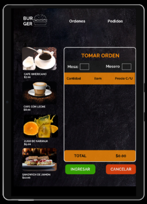 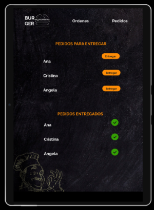

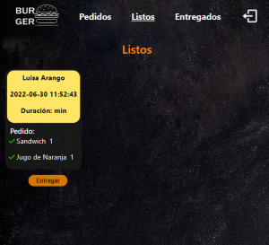

### 4.1 chef

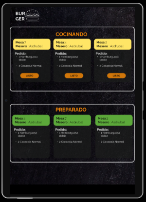

## 5. Deployed project

Link:  https://burger-queen-api-alossada.herokuapp.com/

Credeciales:
* waiter@burger.com
* chef@burger.com

* Password: 123456 

### 5.1 Homepage 

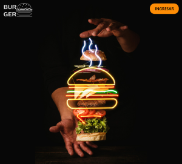

### 5.2 Log in 

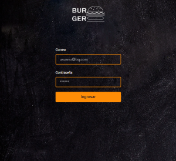  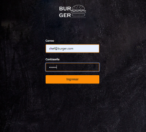

### 5.3 Waiter 

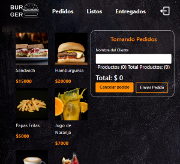 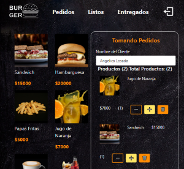

 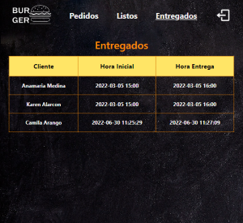

### 5.4 Chef 

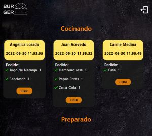 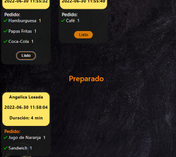

### 5.5 Administrador

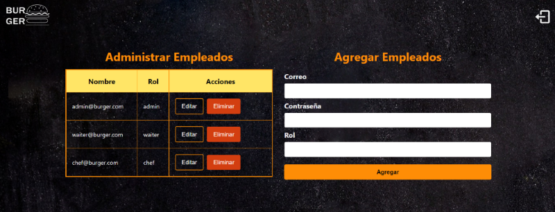 

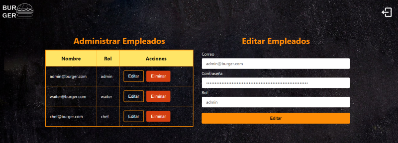

## 6. Authors

| Developers | Contact |
| ------------- | ------------- |
| Lina Marcela Villa Ramirez |   |
| Angélica Losada|   |
